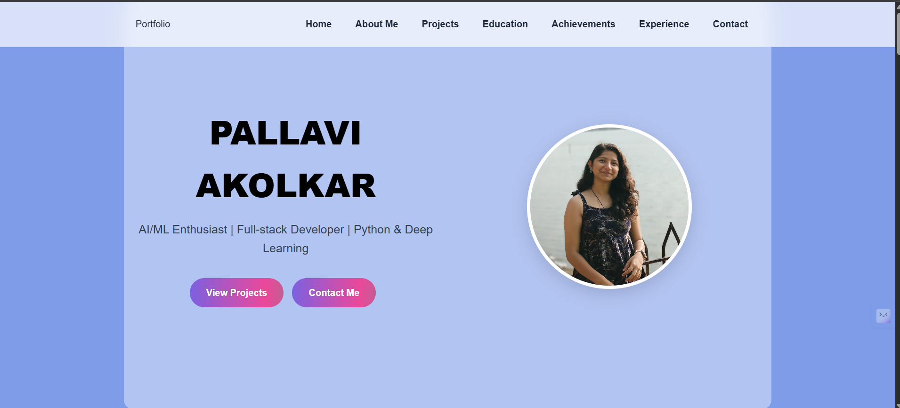
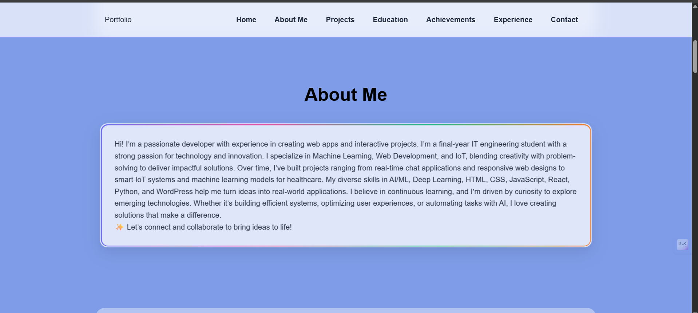
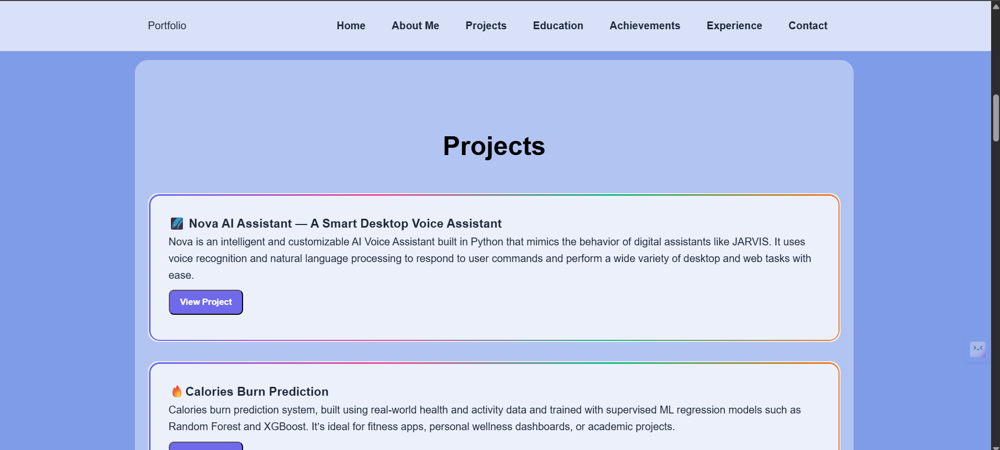
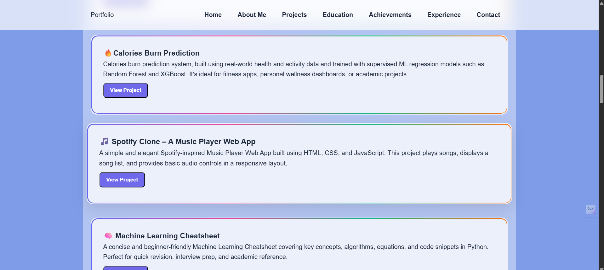
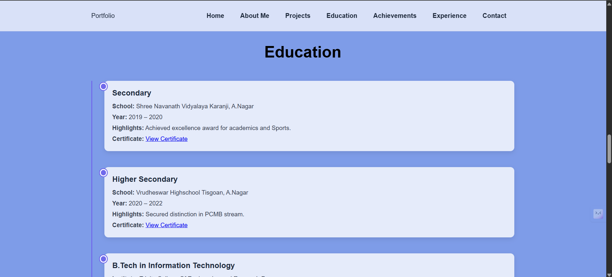
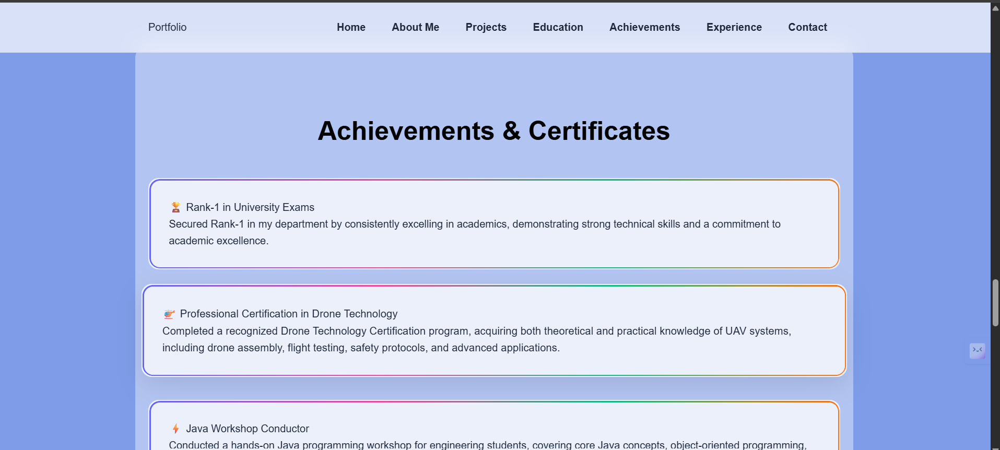
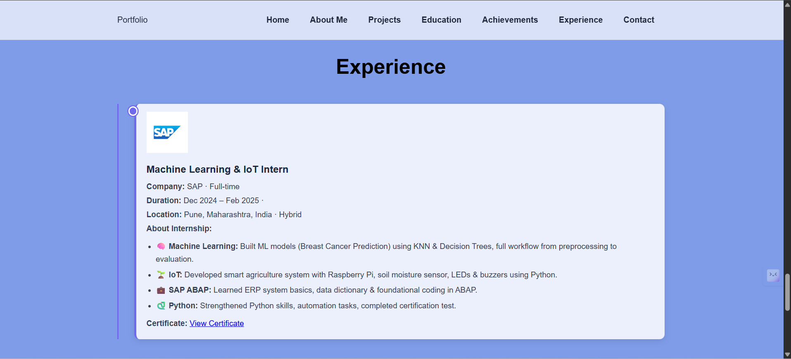
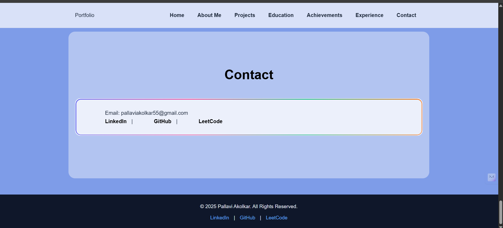

# 🌐 My Portfolio Website

Welcome to the repository of my **personal portfolio website** 🎉.  
This portfolio showcases my **projects, skills, achievements, and experience** in the field of **AI/ML, Web Development, IoT, and Full-stack Engineering**.  

You can visit it live here: 👉 [My Portfolio](https://pallaviakolkar-portfolio.netlify.app/)  

---

## 📸 Preview   

### 🏠 Home Section  
  

### 🙋 About Me  
  

### 📂 Projects Showcase  
  
 

### 🎓 Education Timeline  
  

### 🏆 Achievements & Certificates  
  

### 💼 Experience  
  

### 📬 Contact Section  
  

---

## 🚀 Features  

- 🖥️ **Responsive Design** – Works seamlessly on desktop, tablet, and mobile.  
- 📂 **Projects Showcase** – Highlighting AI/ML, IoT, and Web Development projects.  
- 🎓 **Education Timeline** – Interactive timeline of my academic journey.  
- 🏆 **Achievements & Certificates** – Displaying certifications and awards.  
- 💼 **Experience Section** – Internship and professional experience.  
- 📬 **Contact Section** – Direct links to email, GitHub, LinkedIn, and LeetCode.  

---

## 🛠️ Tech Stack  

- **Frontend:** HTML5, CSS3, JavaScript  
- **Styling:** Responsive design with modern UI/UX practices  
- **Hosting:** Netlify / GitHub Pages  
- **Animations:** Scroll reveal, hover effects, and 3D card tilt  

---

## 📌 Sections Included  

- **Home (Hero Banner)** – Introduction & quick links  
- **About Me** – Who I am, my interests, and passions  
- **Projects** – A list of highlighted projects with GitHub links  
- **Education** – Timeline of schooling and university  
- **Achievements & Certifications** – Key milestones  
- **Experience** – Internships and roles  
- **Contact & Footer** – Social links and email  

---

## 📂 Folder Structure  

```bash
My-Portfolio/
├── index.html        # Main HTML structure
├── style.css         # Styling and responsiveness
├── script.js         # Animations and interactivity
├── images/           # Profile picture and other assets
├── certificates/     # Certificate PDFs (if any)
└── README.md         # Project documentation
